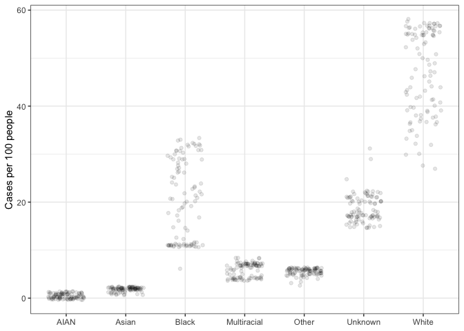
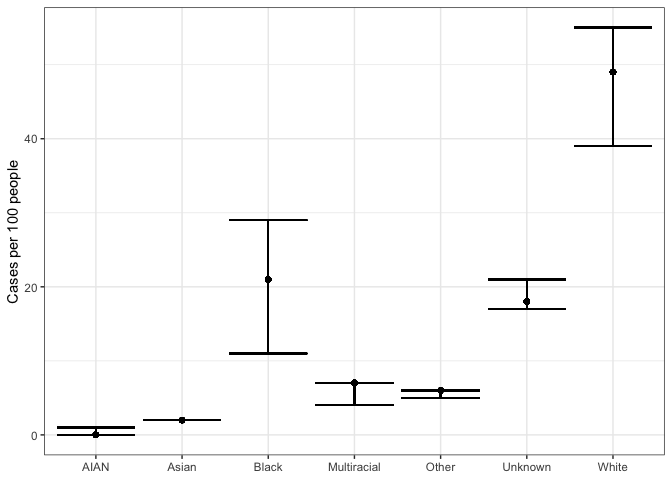
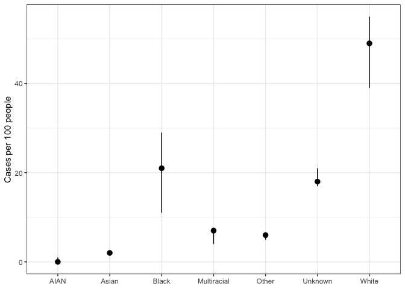
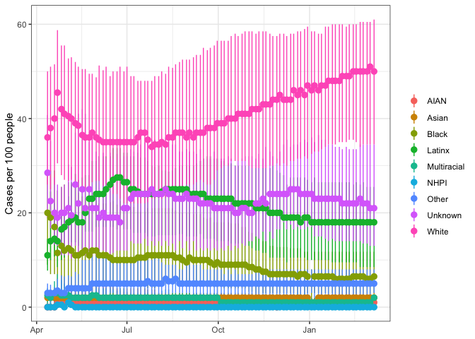
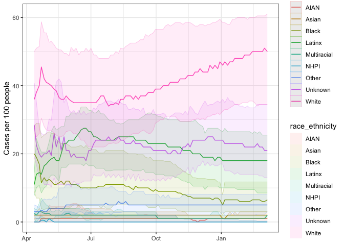
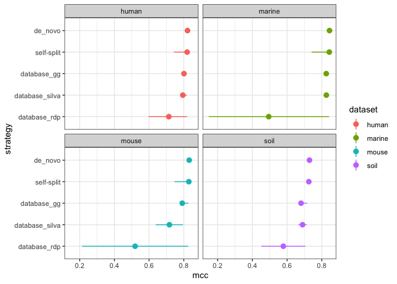

Code Review - stat\_summary
================
Nick Lesniak
2021-03-22

Using data from COVID Racial Data Tracker <https://covidtracking.com/>

### Michigan COVID cases by race from April 12, 2020 through March 7, 2021

``` r
mi_cases %>% 
  ggplot(aes(x = race_ethnicity, y = per100people)) + 
    geom_point(alpha = 0.1, position = position_jitter(0.3)) + 
    theme_bw() + labs(x = NULL, y = 'Cases per 100 people')
```

<!-- -->

This causes a lot of overplotting, let’s calculate the summary
statistics and plot the median and interquartile range.

``` r
mi_cases %>% 
  group_by(type, race_ethnicity) %>% 
  mutate(median = median(per100people),
         lower = quantile(per100people, probs = c(0.25), na.rm = T),
         upper = quantile(per100people, probs = c(0.75), na.rm = T)) %>% 
  ggplot(aes(x = race_ethnicity)) + 
    geom_point(aes(y = median)) + 
    geom_errorbar(aes(ymin = lower, ymax = upper)) + 
    theme_bw() + labs(x = NULL, y = 'Cases per 100 people')
```

<!-- -->

Creating the plot with mutate works, but… what if we want to change
anything in the plot?

What would need to be changed?

What if we could set the plotted stats in the plot itself?

### stat\_summary

You may have actually already been using stat\_summary - for example,
`geom_bar(fun = "mean", stat = "summary")` is using `stat_summary`.  
`stat_summary` allows us to visualize any summary statistic with most
geoms. It is similar to grouping and summarizing within the ggplot layer

``` r
mi_cases %>% 
  group_by(race_ethnicity) %>% 
  summarize(y = median(per100people))
```

    ## # A tibble: 7 x 2
    ##   race_ethnicity     y
    ## * <chr>          <dbl>
    ## 1 AIAN               0
    ## 2 Asian              2
    ## 3 Black             21
    ## 4 Multiracial        7
    ## 5 Other              6
    ## 6 Unknown           18
    ## 7 White             49

Let’s use the `stat_summary` function to tidy up our plotting code

``` r
mi_cases %>% 
  ggplot(aes(x = race_ethnicity, y = per100people)) + 
    stat_summary(fun = median, 
                 geom = 'point') + 
    theme_bw() + labs(x = NULL, y = 'Cases per 100 people')
```

<!-- -->

Here we specify the function to be applied to y, `fun = median`, and how
we want it visualized, `geom = 'point'`. With this information, the
median will be plotted based on the plotting groups, no need to
recalcuate if changing groupings. But what if we wanted to add in error
bars?

We can specify the min and max for geoms that can plot that information.
We can use R functions.

``` r
mi_cases %>% 
  ggplot(aes(x = race_ethnicity, y = per100people)) + 
    stat_summary(fun = median,
                 fun.min = min,
                 fun.max = max,
                 geom = 'pointrange') + 
    theme_bw() + labs(x = NULL, y = 'Cases per 100 people')
```

<!-- -->

Or we can input our own functions.

``` r
mi_cases %>% 
  ggplot(aes(x = race_ethnicity, y = per100people)) + 
    stat_summary(fun = median,
                 fun.min = function(x)quantile(x, probs = 0.25, na.rm = T),
                 fun.max = function(x)quantile(x, probs = 0.75, na.rm = T),
                 geom = 'pointrange') + 
    theme_bw() + labs(x = NULL, y = 'Cases per 100 people')
```

<!-- -->

But for something like mean and confidence intervals, no need to create
this ourselves, theres a function for that. We can use functions from
the `Hmisc` package to process our data using `fun.data`, this takes the
data and calculates the `y`, `ymin` and `ymax`, then outputs a dataframe
from ggplot to plot.

``` r
median_hilow
```

    ## function (x, ...) 
    ## {
    ##     if (!requireNamespace("Hmisc", quietly = TRUE)) 
    ##         abort("Hmisc package required for this function")
    ##     fun <- getExportedValue("Hmisc", fun)
    ##     result <- do.call(fun, list(x = quote(x), ...))
    ##     rename(new_data_frame(as.list(result)), c(Median = "y", Mean = "y", 
    ##         Lower = "ymin", Upper = "ymax"))
    ## }
    ## <bytecode: 0x7fb26a6a7430>
    ## <environment: 0x7fb26a6a66d8>

To see how these functions work, we need to look at the Hmisc functions
that hmisc/ggplot are referencing  
`?Hmisc::smedian.hilow`

``` r
Hmisc::smedian.hilow
```

    ## function (x, conf.int = 0.95, na.rm = TRUE) 
    ## {
    ##     quant <- quantile(x, probs = c(0.5, (1 - conf.int)/2, (1 + 
    ##         conf.int)/2), na.rm = na.rm)
    ##     names(quant) <- c("Median", "Lower", "Upper")
    ##     quant
    ## }
    ## <bytecode: 0x7fb284fd2a58>
    ## <environment: namespace:Hmisc>

``` r
mi_cases %>% 
  group_by(race_ethnicity) %>% 
  summarise(median_hilow(per100people))
```

    ## # A tibble: 7 x 4
    ##   race_ethnicity     y  ymin  ymax
    ## * <chr>          <dbl> <dbl> <dbl>
    ## 1 AIAN               0  0      1  
    ## 2 Asian              2  1      2  
    ## 3 Black             21 11     32.6
    ## 4 Multiracial        7  4      8  
    ## 5 Other              6  3.35   6  
    ## 6 Unknown           18 15     23.9
    ## 7 White             49 30     57

Others functions are  
`mean_cl_boot()`  
`mean_cl_normal()`  
`mean_sdl()`  
`median_hilow()`

``` r
mi_cases %>% 
  ggplot(aes(x = race_ethnicity, y = per100people)) + 
        stat_summary(fun.data = median_hilow, 
                     fun.args = list(conf.int=0.5)) +
      theme_bw() + labs(x = NULL, y = 'Cases per 100 people')
```

<!-- -->

In this example we specified `fun.args = list(conf.int=0.5)` to give us
the interquartile range.

Using this function we can change the data we are plotting without the
need to recalculate and make another new dataframe. Let’s plot the cases
of COVID over time by race for all states.

### Cases of COVID over time by race for all states.

``` r
covid_data %>% 
  filter(type == 'Cases') %>% 
  ggplot(aes(x = Date, y = per100people, color = race_ethnicity)) + 
    stat_summary(fun.data = median_hilow, 
                 fun.args = list(conf.int=0.5)) + 
    theme_bw() + labs(x = NULL, y = 'Cases per 100 people', color = NULL)
```

    ## Warning: Removed 15683 rows containing non-finite values (stat_summary).

<!-- -->

We can customize our plot by layering different `stat_summary` layers.

``` r
covid_data %>% 
  filter(type == 'Cases',
         !is.na(per100people)) %>% 
  ggplot(aes(x = Date, y = per100people, color = race_ethnicity, fill = race_ethnicity)) + 
    stat_summary(fun = median, geom = 'line') +         
    stat_summary(fun.data = median_hilow, fun.args = list(conf.int = 0.5), 
                 geom = 'ribbon', alpha = 0.1, size = 0.1) + 
    theme_bw() + labs(x = NULL, y = 'Cases per 100 people', color = NULL)
```

<!-- -->

### Your turn, what do you see in the COVID data for your home state/or other region of interest?

``` r
covid_data %>% 
```

#### OptiFit project

Kelly & Nick’s breakout room

``` r
library(glue)
```

    ## 
    ## Attaching package: 'glue'

    ## The following object is masked from 'package:dplyr':
    ## 
    ##     collapse

``` r
optifit <- read_tsv('optifit_results.tsv')
```

    ## 
    ## ── Column specification ────────────────────────────────────────────────────────
    ## cols(
    ##   .default = col_double(),
    ##   `h:m:s` = col_time(format = ""),
    ##   group = col_logical(),
    ##   dataset = col_character(),
    ##   ref = col_character(),
    ##   region = col_character(),
    ##   method = col_character(),
    ##   printref = col_logical(),
    ##   tool = col_character(),
    ##   strategy = col_character(),
    ##   ref_weight = col_logical(),
    ##   ref_frac = col_logical(),
    ##   sample_frac = col_logical(),
    ##   num_ref_seqs = col_logical(),
    ##   num_sample_seqs = col_logical(),
    ##   num_total_seqs = col_logical(),
    ##   n_gaps = col_logical(),
    ##   total_chars = col_logical(),
    ##   check_split_passed = col_logical(),
    ##   label...10 = col_logical()
    ## )
    ## ℹ Use `spec()` for the full column specifications.

    ## Warning: 153612 parsing failures.
    ##  row             col           expected actual                  file
    ## 2801 ref_weight      1/0/T/F/TRUE/FALSE simple 'optifit_results.tsv'
    ## 2801 ref_frac        1/0/T/F/TRUE/FALSE 0.1    'optifit_results.tsv'
    ## 2801 sample_frac     1/0/T/F/TRUE/FALSE 0.9    'optifit_results.tsv'
    ## 2801 num_ref_seqs    1/0/T/F/TRUE/FALSE 26176  'optifit_results.tsv'
    ## 2801 num_sample_seqs 1/0/T/F/TRUE/FALSE 235588 'optifit_results.tsv'
    ## .... ............... .................. ...... .....................
    ## See problems(...) for more details.

``` r
optifit %>% 
  mutate(strategy = case_when(
    strategy == "database" ~ as.character(glue("database_{ref}")),
    TRUE ~ strategy)) %>% 
  mutate(strategy = fct_reorder(as.factor(strategy), mcc)) %>% 
  ggplot(aes(x = strategy, y = mcc, color = dataset)) + 
    stat_summary(fun.data = median_hilow, 
                 fun.args = list(conf.int=0.5)) +
  facet_wrap('dataset') +
  coord_flip() +
  theme_bw()
```

<!-- -->
